# clipgen – Project context for AI assistants

## Project overview

clipgen is a Python CLI tool that generates clips from timestamps stored in a Google Sheet or a local Excel file. It uses **gspread** for Google Sheets access, **openpyxl** for Excel, and **ffmpeg/ffprobe** for media processing. The target audience is UX Researchers and professionals who manage playtest videos locally.

**Data flow:** Timestamps in spreadsheet → clipgen reads records (description, study, participant ID, category) → timestamp parsing/annotation filtering → ffmpeg → video clips, screenshots, GIFs, or a single reel.

## Architecture

| File | Role |
| ------ | ------ |
| [clipgen.py](clipgen.py) | Entry point (`python clipgen.py`), spreadsheet opening helpers, interactive mode dispatch, clip/reel processing, timeline viewer |
| [cli.py](cli.py) | CLI argument parsing, CLI mode detection, setup, Google auth, worksheet selection, CLI mode dispatch, `main()` |
| [spreadsheet.py](spreadsheet.py) | Spreadsheet parsing, header validation, selector parsing (`reel` input), pure timestamp generation for all modes (no prompts) |
| [interactive.py](interactive.py) | Interactive prompt helpers for all modes (line/range/cell/category/participant selection, browse mode); keeps generation functions pure |
| [video.py](video.py) | ffmpeg/ffprobe operations: cut clips, screenshots, GIFs, concatenate reels, optional filesize compression |
| [files.py](files.py) | Filename handling (unique names, truncation), `prepare_clip()` (parse timestamps + annotations, sanitize desc/category), clip discovery for reel-late |
| [utils.py](utils.py) | Timestamp parsing, cell/header annotation parsing, rich/plain output helpers, progress bar utilities, keyword-aware input helpers |
| [config.py](config.py) | Global constants and settings (version, headers, limits, commands) |
| [google_api.py](google_api.py) | Google Sheets auth, worksheet selection by priority, spreadsheet listing/search |
| [excel_io.py](excel_io.py) | Excel adapter: `ExcelSheetAdapter` mimics gspread Worksheet interface for local .xlsx |
| [assets/web/](assets/web/) | Static HTML/JS/CSS template for the timeline viewer (`viewer.html`, `viewer.js`, `viewer.css`) |

### Architecture overview

End-to-end data flow from spreadsheet input to video artifacts and optional HTML timeline viewer:

```mermaid
flowchart LR
  user["User"] --> entry["clipgen.py (entry point)"]
  entry --> cli["cli.py (CLI parsing, setup, dispatch)"]

  cli --> sheetSource["Spreadsheet source selection"]
  sheetSource --> googleSheets["google_api.py (Google Sheets)"]
  sheetSource --> excelSheets["excel_io.py (Excel .xlsx)"]

  googleSheets --> spreadsheetLayer["spreadsheet.py (rows, selectors)"]
  excelSheets --> spreadsheetLayer

  spreadsheetLayer --> filesLayer["files.py (prepare_clip, filenames)"]
  filesLayer --> utilsLayer["utils.py (timestamps, annotations)"]
  filesLayer --> videoLayer["video.py (ffmpeg/ffprobe)"]

  utilsLayer --> videoLayer
  videoLayer --> artifacts["Clips / screenshots / GIFs / reels"]

  artifacts --> viewer["assets/web (timeline viewer)"]
```



1. **Input and selection**: `clipgen.py` reads CLI arguments, selects mode, and chooses a spreadsheet source (Google Sheets via `google_api.py` or local Excel via `excel_io.py`).
2. **Spreadsheet layer**: `spreadsheet.py` parses headers, validates layout, interprets the selected mode/selector, and yields logical clip records with per-participant timestamps.
3. **Clip preparation**: `files.py` (with `utils.py`) parses and normalizes timestamps/annotations into `times` ranges, sanitizes study/participant/category names, and generates safe output filenames.
4. **Rendering**: `video.py` uses ffmpeg/ffprobe to cut clips, screenshots, GIFs, or reels from `{study}_{participant}.mp4`, honoring limits and other settings in `config.py`.
5. **Optional viewer**: When requested, `clipgen.py` uses the templates in `assets/web` to build an HTML timeline viewer from the generated artifacts.

## Key data structures

**Clip record** (built in spreadsheet layer, enriched in files):

```python
{
    'cell': gspread.Cell,      # Cell with timestamp value (1-based row/col)
    'desc': str,               # Observation text from Observation column
    'study': str,              # Normalized study name (filesystem-safe)
    'participant': str,        # e.g. 'P01', 'G02' from header
    'category': str,           # Row category (sanitized; empty → 'uncategorized')
    'times': [(start, end)]    # Added by files.prepare_clip() – list of (start_time, end_time) strings
}
```

Source video filenames follow `{study}_{participant}.mp4` (e.g. `mystudy_P01.mp4`).

## Conventions and patterns

- **Coordinates:** gspread uses **1-based** row/col. `sheet.get_all_values()` is a list of lists with **0-based** indices: `sheet_data[row_idx][col_idx]`. Conversions: sheet row = `row_idx + 1`, sheet col = `col_idx + 1`.
- **Timestamps:** Formats `MM:SS` or `HH:MM:SS`. Ranges with `-` (e.g. `1:23-1:45`). Multiple pairs separated by `,`, `;`, `+`, or space. Single time gets end = start + `DEFAULT_DURATION_SECONDS`.
- **Annotations:** `utils.parse_cell_annotations()` strips supported keyphrases (configured in `ANNOTATION_KEYPHRASES`, currently `!key`) before timestamp parsing. Ignored tokens (configured in `IGNORED_TIMESTAMP_TOKENS`, currently `x`) are skipped.
- **Participant IDs:** Headers must start with `P` (individual) or `G` (group); see `config.PARTICIPANT_PREFIXES`.
- **User feedback:** Use `utils.error_print()`, `utils.warning_print()`, `utils.verbose_print()`, `utils.info_print()`. Prefer these over direct `print()` for user-facing messages.
- **Debug:** Set `config.DEBUGGING = True` to enable icecream output and to skip ffmpeg execution paths in [video.py](video.py).
- **Interactive keywords:** All interactive prompts go through `utils.read_user_input()`, which treats first-token commands as:
  - `quit` / `exit` → exit clipgen
  - `top` → return to spreadsheet selection
  - `back` → return to mode selection (or spreadsheet selection if already at mode selection)

## Modes

| Mode | Description |
| ------ | ------------- |
| **batch** | All non-empty timestamp cells in the sheet |
| **line** | One or more specific row numbers (e.g. 5, 7, 12) |
| **range** | Contiguous rows from start to end (inclusive) |
| **category** | Rows matching selected category names |
| **cell** | Specific cells as `participant.row` (e.g. P01.11, P03.11) |
| **participant** | All clips for one or more participants (e.g. P01, P03) |
| **filter** | Only key-marked clips/timestamps (`!key` annotations in timestamp cell content) |
| **screen** | Generate screenshots (`.png`) instead of video clips |
| **gif** | Generate GIFs (`.gif`) from selected timestamps |
| **reel** | Mixed selectors (including `batch`, `filter`, `timeline`, lines/ranges/categories/cells/participants) combined into one video; deduped by cell and ordered by row/column unless timeline is used |
| **timeline** | Chronological reel for exactly one participant (available via reel selector `timeline` or CLI `-T`) |
| **reellate** | Build a reel from already-generated clips in the working directory |
| **browse** | Interactive view of spreadsheet rows (no clip generation) |

Reel selectors: `batch`, `filter`, `timeline`, line numbers, ranges like `13-16`, quoted categories, cells like `P01.11`, participant IDs like `P01`.

CLI mode flags are mutually exclusive for selection (`-b/-l/-r/-C/-c/-p/-f/-M/-R/-T`) and can be combined with output format flags (`--screen` or `--gif`) except reel/timeline, which always output a single video reel. `-C/--category` accepts one or more category names (comma- or plus-separated, e.g. `"Observations,Onboarding"`), and `-M/--mixed` combines selectors for individual outputs.

Interactive-only modes without dedicated CLI flags:

- `reellate` – combine already-generated clips in the working directory into a highlight reel.
- `browse` – interactive spreadsheet browser for inspecting rows and timestamps.
- Interactive `viewer` – launches the HTML timeline viewer based on artifacts generated in the current interactive session (CLI uses `--viewer` instead).

## Important configuration ([config.py](config.py))

- `WORKSHEET_PRIORITY` – Worksheet names tried first (e.g. 'Sheet1', 'Data', 'Observations')
- `ID_HEADER`, `OBSERVATION_HEADER`, `CATEGORY_HEADER` – Required column headers
- `PARTICIPANT_PREFIXES` – `('P', 'G')`
- `ANNOTATION_KEYPHRASES` – maps tokens like `!key` to annotation names (`key`)
- `IGNORED_TIMESTAMP_TOKENS` – tokens ignored during timestamp parsing (default includes `x`)
- `FILEFORMAT` – `.mp4`
- `MAX_CLIP_DURATION_SECONDS` – 600 (10 min); prompts before generating longer clips
- `DEFAULT_DURATION_SECONDS` – 60 (used when only start time is given)
- `DEFAULT_GIF_DURATION_SECONDS` – 5 (GIF extraction length)
- `MAX_FILENAME_LENGTH` – 255
- `MAX_FILESIZE_MB` – optional output filesize cap for generated videos (`0` disables)
- `COMMAND_LIST_ALL`, `COMMAND_LIST_NEW`, `COMMAND_OPEN_LAST`, `COMMAND_EXCEL`, `COMMAND_HTTP_PREFIX`, `COMMAND_SETTINGS` – Interactive spreadsheet selection commands

## Spreadsheet layout

- Row 0 (A1): Study name (optional; falls back to spreadsheet title).
- Header row: Must include columns **ID**, **Observation**, **Category** (exact names from config).
- Participant columns: Immediately after ID; headers start with P or G (e.g. P01, P02, G01). Each holds timestamp strings; non-empty cells become clip candidates.
- Observation column: Human-readable description per row.
- Category column: Label per row for category/reel selection.

Optional clock baseline row:

- A single sheet-wide **baseline marker row** contains the label `Baseline time` in one of its cells and per-participant baseline timestamps in the participant columns.
- Each non-empty baseline cell in that row (e.g. `09:12:00` under `P01`) marks that participant column as using **clock/absolute** timestamps.
- During `files.prepare_clip()`, all `(start, end)` pairs in that column are converted to **relative** offsets by subtracting the per-column baseline via `utils.convert_clock_pairs_to_relative()`.
- Empty baseline cells in the marker row mean the participant column uses **relative** timestamps (no conversion applied).
- If no `Baseline time` marker row is present at all, all participant columns are treated as using relative timestamps.

Reference spreadsheet layout is described in [README.md](README.md).

## Timeline HTML Viewer

- **Opt-in**: CLI flag `--viewer` or interactive `viewer` mode from the mode selection prompt.
- **Assets**: Static template in [assets/web/](assets/web/) (`viewer.html`, `viewer.js`, `viewer.css`). Per-run, Python copies these into the artifact directory and injects a `<script>window.CLIPGEN_DATA={...};</script>` block replacing the `<!-- CLIPGEN_DATA_HERE -->` placeholder.
- **Data contract** (`window.CLIPGEN_DATA`): JSON object with `meta` (study, participant, generatedAt, mode, sourceSpreadsheet, sourceFileType), `artifacts` (array of {id, type, file, start, end, study, participant, category, description, cellRow, cellCol, cellA1, annotations, sourceVideo}), and `timeline` ({duration, startOffset}).
- **Key functions**: `build_artifact_records_for_clip()`, `finalize_timeline_data()`, `generate_timeline_viewer()` – all in [clipgen.py](clipgen.py).
- Reel mode artifact collection is stubbed (returns empty artifacts list) for future enhancement.

## Version

- The version is stored as `VERSIONNUM` in [config.py](config.py) (currently `'0.8.22'`).
- **When making substantive code changes** (bug fixes or features), increment the **last segment only** (patch) in `config.py`, e.g. `0.8.22` → `0.8.23`. Do not bump for docs-only, comment-only, or refactor-only changes unless they affect user-visible behavior.

## Testing notes

- There is no test suite in the repo.
- With `config.DEBUGGING = True`, icecream is enabled and [video.py](video.py) does not invoke ffmpeg (returns without writing files where applicable).
