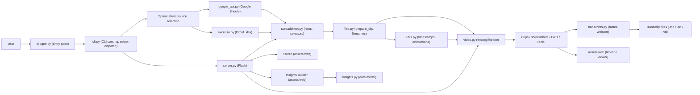

# clipgen – Project context for AI assistants

## Additional rules availble outside this file

@AGENTS.md

## Project overview

clipgen is a Python CLI tool that generates clips from timestamps stored in a Google Sheet or a local Excel file. It uses **gspread** for Google Sheets access, **openpyxl** for Excel, and **ffmpeg/ffprobe** for media processing. The target audience is UX Researchers and professionals who manage playtest videos locally.

**Data flow:** Timestamps in spreadsheet → clipgen reads records (description, study, participant ID, category) → timestamp parsing/annotation filtering → ffmpeg → video clips, screenshots, GIFs, or a single reel. Optionally, generated artifacts can be transcribed via faster-whisper to produce timestamped transcript files.

## Architecture

| File | Role |
| ------ | ------ |
| [clipgen.py](clipgen.py) | Entry point (`python clipgen.py`), spreadsheet opening helpers, interactive mode dispatch, clip/reel processing |
| [viewer.py](viewer.py) | Timeline viewer: artifact record building, data finalization, HTML generation with inlined CSS/JS |
| [cli.py](cli.py) | CLI argument parsing, CLI mode detection, setup, Google auth, worksheet selection, CLI mode dispatch, `main()` |
| [spreadsheet.py](spreadsheet.py) | Spreadsheet parsing, header validation, selector parsing (`reel` input), pure timestamp generation for all modes (no prompts) |
| [interactive.py](interactive.py) | Interactive prompt helpers for all modes (line/range/cell/category/participant selection, browse mode); keeps generation functions pure |
| [video.py](video.py) | ffmpeg/ffprobe operations: cut clips, screenshots, GIFs, concatenate reels, optional filesize compression |
| [transcripts.py](transcripts.py) | Transcription via faster-whisper: `transcribe_video()`, segment filtering, write/read transcript files (Markdown/SRT/VTT) |
| [files.py](files.py) | Filename handling (unique names, truncation), `prepare_clip()` (parse timestamps + annotations, sanitize desc/category), clip discovery for reel-late |
| [utils.py](utils.py) | Timestamp parsing, cell/header annotation parsing, rich/plain output helpers, progress bar utilities, keyword-aware input helpers |
| [config.py](config.py) | Global constants and settings (version, headers, limits, commands) |
| [google_api.py](google_api.py) | Google Sheets auth, worksheet selection by priority, spreadsheet listing/search |
| [excel_io.py](excel_io.py) | Excel adapter: `ExcelSheetAdapter` mimics gspread Worksheet interface for local .xlsx |
| [server.py](server.py) | Combined Flask server for Studio + Insights; Studio REST API (sheet data, generate, reel, viewer, manifest, regenerate) |
| [insights.py](insights.py) | Insights data model: CRUD operations for insight records, insights manifest read/write |
| [insights_server.py](insights_server.py) | Insights Builder Flask REST API: insight CRUD, artifact browsing, sprite sheet generation, viewer export |
| [assets/web/](assets/web/) | Static HTML/JS/CSS templates: timeline viewer (`viewer.html/js/css`), gallery (`gallery.html/js/css`), studio (`studio.html/js/css`), insights builder (`insights-builder.html/js/css`), insights viewer (`insights-viewer.html/js/css`) |

### Architecture overview

End-to-end data flow from spreadsheet input to video artifacts and optional HTML timeline viewer:



1. **Input and selection**: `clipgen.py` reads CLI arguments, selects mode, and chooses a spreadsheet source (Google Sheets via `google_api.py` or local Excel via `excel_io.py`).
2. **Spreadsheet layer**: `spreadsheet.py` parses headers, validates layout, interprets the selected mode/selector, and yields logical clip records with per-participant timestamps.
3. **Clip preparation**: `files.py` (with `utils.py`) parses and normalizes timestamps/annotations into `times` ranges, sanitizes study/participant/category names, and generates safe output filenames.
4. **Rendering**: `video.py` uses ffmpeg/ffprobe to cut clips, screenshots, GIFs, or reels from `{study}_{participant}.mp4`, honoring limits and other settings in `config.py`.
5. **Optional transcription**: When `--transcribe` is set, `transcripts.py` uses faster-whisper to transcribe source videos (cached per video), filters segments to each clip's time range, and writes transcript files alongside artifacts.
6. **Optional viewer**: When requested, `clipgen.py` uses the templates in `assets/web` to build an HTML timeline viewer from the generated artifacts.
7. **Web interfaces**: When `--studio` or `--insights` is passed, `server.py` starts a combined Flask server. Studio serves an interactive spreadsheet grid backed by the same spreadsheet/video pipeline. Insights Builder reads `clipgen_manifest.json` and provides CRUD for structured research findings, persisted to `insights_manifest.json`.

## Key data structures

**Clip record** (built in spreadsheet layer, enriched in files):

```python
{
    'cell': gspread.Cell,      # Cell with timestamp value (1-based row/col)
    'desc': str,               # Observation text from Observation column
    'study': str,              # Normalized study name (filesystem-safe)
    'participant': str,        # e.g. 'P01', 'G02' from header
    'category': str,           # Row category (sanitized; empty → 'uncategorized')
    'severity': str,           # Row severity (normalized label; empty if no Severity column)
    'times': [(start, end)]    # Added by files.prepare_clip() – list of (start_time, end_time) strings
}
```

Source video filenames follow `{study}_{participant}.mp4` (e.g. `mystudy_P01.mp4`).

## Development tools

- **uv** – Use `uv run` instead of `python` to run scripts (e.g. `uv run clipgen.py`). Use `uv add` to add dependencies.
- **Ruff** – Linting and formatting. A `PostToolUse` hook in `.claude/settings.json` automatically runs `ruff check --fix` and `ruff format` on every edited/written file. You can also run `ruff check` or `ruff format` manually.
- **ty** – Use `ty check` for type checking.

## Conventions and patterns

- **Coordinates:** gspread uses **1-based** row/col. `sheet.get_all_values()` is a list of lists with **0-based** indices: `sheet_data[row_idx][col_idx]`. Conversions: sheet row = `row_idx + 1`, sheet col = `col_idx + 1`.
- **Timestamps:** Formats `MM:SS` or `HH:MM:SS`. Ranges with `-` (e.g. `1:23-1:45`). Multiple pairs separated by `,`, `;`, `+`, or space. Single time gets end = start + `DEFAULT_DURATION_SECONDS`.
- **Annotations:** `utils.parse_cell_annotations()` strips supported keyphrases (configured in `ANNOTATION_KEYPHRASES`, currently `!key`) before timestamp parsing. Ignored tokens (configured in `IGNORED_TIMESTAMP_TOKENS`, currently `x`) are skipped.
- **Participant IDs:** Headers must start with `P` (individual) or `G` (group); see `config.PARTICIPANT_PREFIXES`.
- **User feedback:** Use `utils.error_print()`, `utils.warning_print()`, `utils.verbose_print()`, `utils.info_print()`. Prefer these over direct `print()` for user-facing messages.
- **Debug:** Set `config.DEBUGGING = True` to enable icecream output, skip ffmpeg execution paths in [video.py](video.py), and return stub transcript results in [transcripts.py](transcripts.py) without loading a Whisper model.
- **Interactive keywords:** All interactive prompts go through `utils.read_user_input()`, which treats first-token commands as:
  - `quit` / `exit` → exit clipgen
  - `top` → return to spreadsheet selection
  - `back` → return to mode selection (or spreadsheet selection if already at mode selection)

## Modes

| Mode | Description |
| ------ | ------------- |
| **batch** | All non-empty timestamp cells in the sheet |
| **line** | One or more specific row numbers (e.g. 5, 7, 12) |
| **range** | Contiguous rows from start to end (inclusive) |
| **category** | Rows matching selected category names |
| **cell** | Specific cells as `participant.row` (e.g. P01.11, P03.11) |
| **participant** | All clips for one or more participants (e.g. P01, P03) |
| **keyword** | Only key-marked clips/timestamps (`!key` annotations in timestamp cell content) |
| **severity** | Rows matching selected severity levels (optional Severity column; numeric -4..+2 or labels like Critical/High/Medium/Low/N/A/Positive/Very Positive) |
| **screen** | Generate screenshots (`.png`) instead of video clips |
| **gif** | Generate GIFs (`.gif`) from selected timestamps |
| **reel** | Mixed selectors (including `batch`, `keyword`, `chronologic`, `severity`, `highlights`, lines/ranges/categories/cells/participants) combined into one video; deduped by cell and ordered by row/column unless chronologic, severity, or highlights ordering is used |
| **chronologic** | Chronological reel for exactly one participant (available via reel selector `chronologic` or CLI `-T`) |
| **highlights** | Auto-select best clips within a time budget, scored by severity, uniqueness, and keyword annotations (available via reel selector `highlights` or CLI `-H`) |
| **reellate** | Build a reel from already-generated clips in the working directory |
| **gallery** | Generate interval screenshots/GIFs from a video and build a gallery HTML viewer (available via interactive `gv`/`gallery` or CLI `--gallery`) |
| **browse** | Interactive view of spreadsheet rows (no clip generation) |
| **studio** | Web-based interactive artifact generation and reel building from spreadsheet data (CLI `--studio`; requires spreadsheet) |
| **insights** | Web-based Insights Builder for authoring structured UX research findings from generated artifacts (CLI `--insights`; no spreadsheet required) |

Reel selectors: `batch`, `keyword`, `chronologic`, `severity`, `highlights`, line numbers, ranges like `13-16`, quoted categories, cells like `P01.11`, participant IDs like `P01`.

CLI mode flags are mutually exclusive for selection (`-b/-l/-r/-C/-c/-p/-k/-S/-M/-R/-T/-H`) and can be combined with output format flags (`--screen` or `--gif`) except reel/chronologic/highlights, which always output a single video reel. `-H/--highlights` generates a highlights reel scored by severity, uniqueness, and keyword annotations within a configurable time budget (default 180s); optionally pass a duration in seconds (e.g. `-H 120`). `-C/--category` accepts one or more category names (comma- or plus-separated, e.g. `"Observations,Onboarding"`), `-k/--keyword` selects only key-annotated clips, `-S/--severity` accepts severity levels (e.g. `"Critical,High"` or `"-4,-3"`), and `-M/--mixed` combines selectors for individual outputs. `--transcribe` can be combined with any mode/format to generate transcript files alongside artifacts; `--transcript-format` overrides the output format (`md`, `srt`, `vtt`).

`--gallery [VIDEO]` generates interval screenshots or GIFs from a video file and builds a gallery HTML viewer. Combine with `--gif` for GIF output and `--interval N` to set the capture interval in seconds (default 10). No spreadsheet is required.

`--studio` launches a Flask-based web interface for interactive artifact generation. Requires a spreadsheet (Google Sheets or Excel); can combine with `-s`, `-i/-o`, `-v`. Cannot combine with mode flags, format flags, `--viewer`, or `--regenerate`. `--insights` launches the Insights Builder for authoring research findings from generated artifacts; no spreadsheet required. Can combine with `-i/-o`, `-v`. Cannot combine with mode flags, format flags, `--viewer`, `--regenerate`, or `--studio`. `--manifest` writes a cumulative artifact manifest (`clipgen_manifest.json`) alongside generated clips; required by `--insights` and `--regenerate`. `--regenerate` re-creates all media artifacts and reels from a saved manifest without a spreadsheet.

Interactive-only modes without dedicated CLI flags:

- `reellate` – combine already-generated clips in the working directory into a highlight reel.
- `browse` – interactive spreadsheet browser for inspecting rows and timestamps.
- Interactive `viewer` – launches the HTML timeline viewer based on artifacts generated in the current interactive session (CLI uses `--viewer` instead).

## Important configuration ([config.py](config.py))

- `WORKSHEET_PRIORITY` – Worksheet names tried first (e.g. 'Sheet1', 'Data', 'Observations')
- `ID_HEADER`, `OBSERVATION_HEADER`, `CATEGORY_HEADER` – Required column headers
- `SEVERITY_HEADER` – Optional column header (`"Severity"`); when present, adds severity metadata to clips
- `SEVERITY_NUMERIC_TO_LABEL`, `SEVERITY_LABEL_TO_NUMERIC` – Canonical severity mapping (-4=Critical through +2=Very Positive)
- `PARTICIPANT_PREFIXES` – `('P', 'G')`
- `ANNOTATION_KEYPHRASES` – maps tokens like `!key` to annotation names (`key`)
- `IGNORED_TIMESTAMP_TOKENS` – tokens ignored during timestamp parsing (default includes `x`)
- `FILEFORMAT` – `.mp4`
- `MAX_CLIP_DURATION_SECONDS` – 600 (10 min); prompts before generating longer clips
- `DEFAULT_DURATION_SECONDS` – 60 (used when only start time is given)
- `DEFAULT_GIF_DURATION_SECONDS` – 5 (GIF extraction length)
- `GALLERY_INTERVAL_SECONDS` – 10 (default interval between gallery captures)
- `GALLERY_GIF_DURATION_SECONDS` – 3 (default per-GIF duration in gallery mode)
- `MAX_FILENAME_LENGTH` – 255
- `MAX_FILESIZE_MB` – optional output filesize cap for generated videos (`0` disables)
- `HIGHLIGHTS_REEL_DURATION_SECONDS` – 180 (3-minute time budget for highlights reel)
- `HIGHLIGHTS_WEIGHT_SEVERITY`, `HIGHLIGHTS_WEIGHT_UNIQUENESS`, `HIGHLIGHTS_WEIGHT_KEYWORD` – Scoring weights for highlights reel clip ranking (default 1.0, 0.5, 0.3)
- `COMMAND_LIST_ALL`, `COMMAND_LIST_NEW`, `COMMAND_OPEN_LAST`, `COMMAND_EXCEL`, `COMMAND_HTTP_PREFIX`, `COMMAND_SETTINGS` – Interactive spreadsheet selection commands
- `TRANSCRIBE_ENABLED` – `False`; set `True` or use `--transcribe` CLI flag to generate transcripts alongside artifacts
- `TRANSCRIBE_MODEL` – Whisper model size: `tiny`, `base` (default), `small`, `medium`, `large-v3`
- `TRANSCRIBE_LANGUAGE` – `None` (auto-detect) or language code like `"en"`
- `TRANSCRIBE_COMPUTE_TYPE` – `"int8"` (fastest), `"float16"`, or `"float32"`
- `TRANSCRIBE_FORMAT` – Output format: `"md"` (Markdown, default), `"srt"`, or `"vtt"`
- `TRANSCRIBE_INITIAL_PROMPT` – Context prompt sent to Whisper (default: UX research session description)
- `TRANSCRIBE_BEAM_SIZE` – Beam search width (`5` default)
- `MANIFEST_FILENAME` – `"clipgen_manifest.json"` – cumulative artifact manifest file name
- `MANIFEST_ENABLED` – `False`; set `True` or use `--manifest` CLI flag to write manifest alongside generated artifacts
- `SERVER_PORT` – `8089` – port for the combined Studio/Insights Flask server
- `INSIGHTS_MANIFEST_FILENAME` – `"insights_manifest.json"` – insights data manifest file name
- `SPRITE_SHEET_FRAME_COUNT` – `20` – number of frames extracted per sprite sheet
- `SPRITE_SHEET_THUMB_WIDTH` – `160` – pixel width of each sprite thumbnail
- `SPRITE_SHEET_MIN_INTERVAL` – `1` – minimum seconds between sprite frames

## Spreadsheet layout

- Row 0 (A1): Study name (optional; falls back to spreadsheet title).
- Header row: Must include columns **ID**, **Observation**, **Category** (exact names from config).
- Participant columns: Immediately after ID; headers start with P or G (e.g. P01, P02, G01). Each holds timestamp strings; non-empty cells become clip candidates.
- Observation column: Human-readable description per row.
- Category column: Label per row for category/reel selection.
- Severity column (optional): Per-row severity level for severity mode filtering and reel sorting. Values can be numeric (-4 to +2) or string labels (Critical, High, Medium, Low, N/A, Positive, Very Positive). Detected via `sheet.find("Severity")`.

Optional clock baseline row:

- A single sheet-wide **baseline marker row** contains the label `Baseline time` in one of its cells and per-participant baseline timestamps in the participant columns.
- Each non-empty baseline cell in that row (e.g. `09:12:00` under `P01`) marks that participant column as using **clock/absolute** timestamps.
- During `files.prepare_clip()`, all `(start, end)` pairs in that column are converted to **relative** offsets by subtracting the per-column baseline via `utils.convert_clock_pairs_to_relative()`.
- Empty baseline cells in the marker row mean the participant column uses **relative** timestamps (no conversion applied).
- If no `Baseline time` marker row is present at all, all participant columns are treated as using relative timestamps.

Reference spreadsheet layout is described in [README.md](README.md).

## Timeline HTML Viewer

- **Opt-in**: CLI flag `--viewer` or interactive `viewer` mode from the mode selection prompt.
- **Assets**: Static template in [assets/web/](assets/web/) (`viewer.html`, `viewer.js`, `viewer.css`). Per-run, Python copies these into the artifact directory and injects a `<script>window.CLIPGEN_DATA={...};</script>` block replacing the `<!-- CLIPGEN_DATA_HERE -->` placeholder.
- **Data contract** (`window.CLIPGEN_DATA`): JSON object with `meta` (study, participant, generatedAt, mode, sourceSpreadsheet, sourceFileType), `artifacts` (array of {id, type, file, start, end, study, participant, category, description, cellRow, cellCol, cellA1, annotations, sourceVideo}), and `timeline` ({duration, startOffset}).
- **Key functions**: `build_artifact_records_for_clip()`, `finalize_timeline_data()`, `generate_timeline_viewer()` – all in [viewer.py](viewer.py).
- Reel mode artifact collection is stubbed (returns empty artifacts list) for future enhancement.

## Gallery HTML Viewer

- **Opt-in**: CLI flag `--gallery [VIDEO]` or interactive `gv`/`gallery` mode.
- **Assets**: Static template in [assets/web/](assets/web/) (`gallery.html`, `gallery.js`, `gallery.css`). Follows the same inlining pattern as the timeline viewer.
- **Data contract** (`window.CLIPGEN_DATA`): JSON object with `meta` (sourceVideo, generatedAt, mode, format, interval, videoDuration) and `artifacts` (array of {file, timestamp, timestamp_formatted, type, duration}).
- **Key functions**: `generate_interval_captures()` in [video.py](video.py), `finalize_gallery_data()` and `generate_gallery_viewer()` in [viewer.py](viewer.py).
- Gallery artifacts are NOT written to the manifest by default.

## Studio Web Interface

- **Opt-in**: CLI flag `--studio`. Requires a spreadsheet (Google Sheets or Excel).
- **Server**: `start_combined_server()` in [server.py](server.py) starts a Flask app serving both Studio (at `/studio/`) and Insights Builder (at `/insights/`) on `config.SERVER_PORT` (default 8089). Opens the browser automatically.
- **Assets**: Static template in [assets/web/](assets/web/) (`studio.html`, `studio.js`, `studio.css`). Served directly by Flask (no inlining).
- **API endpoints** (all under `/studio/`):
  - `GET /api/sheet` – returns spreadsheet grid data (rows, participants, observations, categories, severity, per-cell timestamp validity)
  - `POST /api/generate` – generates artifacts for specified cells in a given format (clip/screen/gif)
  - `POST /api/reel` – builds a reel from specified cells
  - `POST /api/viewer` – generates a timeline viewer from session artifacts
  - `POST /api/timeline-viewer` – batch-exports all clips and generates a timeline viewer
  - `POST /api/manifest` – writes the cumulative artifact manifest to disk
  - `POST /api/regenerate` – regenerates all media from saved manifest
  - `GET /api/status` – reports which interfaces are available (studio/insights)
- **State**: Module-level `_worksheet`, `_sheet_context`, `_generated_artifacts`, `_generated_reels` in [server.py](server.py), initialized by `_init_studio_state()`.
- **Key function**: `start_combined_server(worksheet, port, default_page)` – registers both Studio and Insights blueprints on one Flask app.

## Insights Builder ([insights.py](insights.py), [insights_server.py](insights_server.py))

- **Opt-in**: CLI flag `--insights`. No spreadsheet required; reads from `clipgen_manifest.json`.
- **Server**: Served by the same combined Flask server as Studio, at `/insights/`. When `--insights` is used alone (no spreadsheet), only the Insights blueprint is active.
- **Assets**: Static template in [assets/web/](assets/web/) (`insights-builder.html/js/css` for the builder, `insights-viewer.html/js/css` for the exported viewer). Builder is served by Flask; viewer is generated as a standalone HTML file via `generate_insights_viewer()`.
- **Data model** ([insights.py](insights.py)):
  - `load_insights_manifest()` / `save_insights_manifest()` – read/write `insights_manifest.json`
  - `create_insight()` – returns a new insight dict with all fields initialized
  - `update_insight()` – merge updates into an existing insight by ID
  - `delete_insight()` – remove an insight by ID
- **Insight record**:
  ```python
  {
      "id": "ins_<8hex>",         # Unique ID (uuid4 hex prefix)
      "title": str,
      "summary": str,
      "severity": str,            # Critical/High/Medium/Low/N/A/Positive/Very Positive
      "status": str,              # "draft" or "final"
      "createdAt": str,           # ISO 8601 UTC
      "updatedAt": str,           # ISO 8601 UTC
      "causes": {"narrative": str, "artifacts": [ids]},
      "behaviors": {"narrative": str, "artifacts": [ids]},
      "impacts": {"narrative": str, "artifacts": [ids]},
      "timelineContext": str,
  }
  ```
- **API endpoints** (all under `/insights/`):
  - `GET /api/artifacts` – returns artifacts from manifest, enriched with sprite sheet data
  - `GET/POST /api/insights` – list all or create new insight
  - `GET/PUT/DELETE /api/insights/<id>` – read, update, or delete a single insight
  - `POST /api/sprites/generate` – generate missing sprite sheets for clip artifacts
  - `POST /api/generate-viewer` – export standalone insights viewer HTML
  - `GET /media/<filename>` – serve artifact media files from output directory
- **Sprite sheets**: `video.generate_sprite_sheet()` extracts frames at regular intervals and tiles them into a PNG contact sheet for hover-to-scrub previews. Configured by `SPRITE_SHEET_FRAME_COUNT`, `SPRITE_SHEET_THUMB_WIDTH`, `SPRITE_SHEET_MIN_INTERVAL` in [config.py](config.py).
- **Viewer export**: `finalize_insights_viewer_data()` and `generate_insights_viewer()` in [viewer.py](viewer.py) produce a standalone `insights_viewer.html`. Shows only "final" insights if any exist; otherwise shows all. Only artifacts referenced by visible insights are included.
- **Manifests**: `clipgen_manifest.json` (artifacts, read-only) and `insights_manifest.json` (insights, read-write) in the output directory.

## Artifact Manifest

- **Opt-in**: CLI flag `--manifest` or `config.MANIFEST_ENABLED = True` via interactive settings.
- **File**: `clipgen_manifest.json` in the output directory (name from `config.MANIFEST_FILENAME`).
- **Key functions** in [viewer.py](viewer.py):
  - `save_manifest(new_artifacts, *, new_reels, study, ...)` – merges new artifacts/reels into existing manifest (deduplicates by `id`; newer entries win) and writes JSON.
  - `load_manifest_artifacts()` – reads artifact records from manifest, or returns `[]`.
  - `load_manifest_reels()` – reads reel records from manifest, or returns `[]`.
- **Regeneration**: `--regenerate` CLI flag invokes `clipgen.regenerate_from_manifest()`, which re-creates media artifacts and reels from manifest entries without a spreadsheet. Skips transcript-type artifacts.
- **Consumers**: The Insights Builder reads `clipgen_manifest.json` for its media library. Studio can export and regenerate from manifest. The standalone `--viewer` flag (without a mode) also reads from manifest.

## Transcription ([transcripts.py](transcripts.py))

- **Opt-in**: CLI flag `--transcribe` or `config.TRANSCRIBE_ENABLED = True` via interactive settings.
- **Engine**: [faster-whisper](https://github.com/SYSTRAN/faster-whisper) (CTranslate2-based Whisper). Model is lazy-loaded on first use and cached at module level for the session.
- **Key functions**:
  - `transcribe_video(video_path, *, language, initial_prompt, context_keywords)` → `TranscriptResult` with timestamped segments, detected language, source file, model name. Accepts optional `context_keywords` list appended to the initial prompt.
  - `filter_segments(result, start_sec, end_sec, *, offset_to_zero)` → filtered `TranscriptResult` for a clip's time range; `offset_to_zero=True` shifts times so the clip starts at 0:00.
  - `write_transcript(result, output_path, *, fmt)` → writes Markdown (`.md`), SRT (`.srt`), or WebVTT (`.vtt`).
  - `read_transcript(filepath)` → parses any supported format back into `TranscriptResult` (for future subtitle/viewer use).
  - `get_transcript_extension(fmt)` → returns the file extension for a format string.
- **Data types**: `TranscriptSegment` (start, end, text) and `TranscriptResult` (segments, language, source_file, model) — both `TypedDict`.
- **Pipeline integration**: In `clipgen.process_clips()`, `_transcribe_segments()` caches full-video transcription per source video, then filters and writes per-clip transcripts. Transcript artifacts (type `"transcript"`) are added to the artifact list for manifest tracking.
- **Output filenames**: Match the corresponding clip filename but with the transcript extension (e.g. `[Onboarding] study P01 desc.md`).

## Version

- The version is stored as `VERSIONNUM` in [config.py](config.py).
- **When making substantive code changes** (bug fixes or features), increment the **last segment only** (patch) in `config.py`, e.g. `0.9.0` → `0.9.1`. Do not bump for docs-only, comment-only, or refactor-only changes unless they affect user-visible behavior.

## Testing notes

- Run the test suite with `pytest -c tests/pytest.ini` from the project root.
- Tests cover: CLI argument parsing, CLI mode dispatch, clip pipeline, file/artifact handling, Google/Excel adapters, insights data model, insights API, manifest operations, selectors, spreadsheet generation, studio API, titlecards, transcripts, timestamp utilities, video commands, viewer data, and viewer inlining.
- Every new CLI mode, flag, or selector should include at least one smoke test in the same PR.
- With `config.DEBUGGING = True`, icecream is enabled, [video.py](video.py) does not invoke ffmpeg, and [transcripts.py](transcripts.py) returns stub results without loading a Whisper model.
